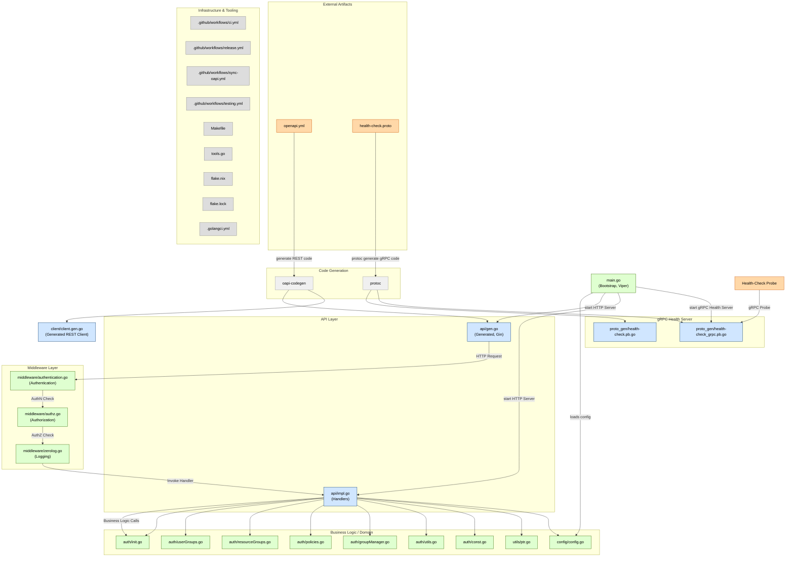

#  Enclave Shared Dependencies
> [!WARNING]
> The enclave project is still under heavy development and object to changes. This can include APIs, schemas, interfaces and more. Productive usage is therefore not recommended yet (as long as no stable version is released).

> - Viper for configuration
> - Zap for logging
> - Gin Gonic for HTTP server
> - go-playground/validator for validation

